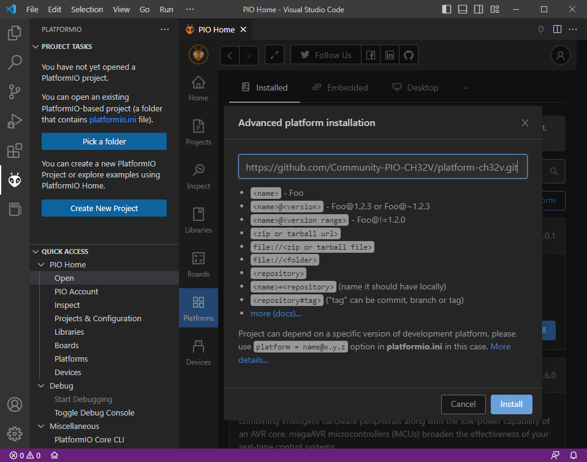
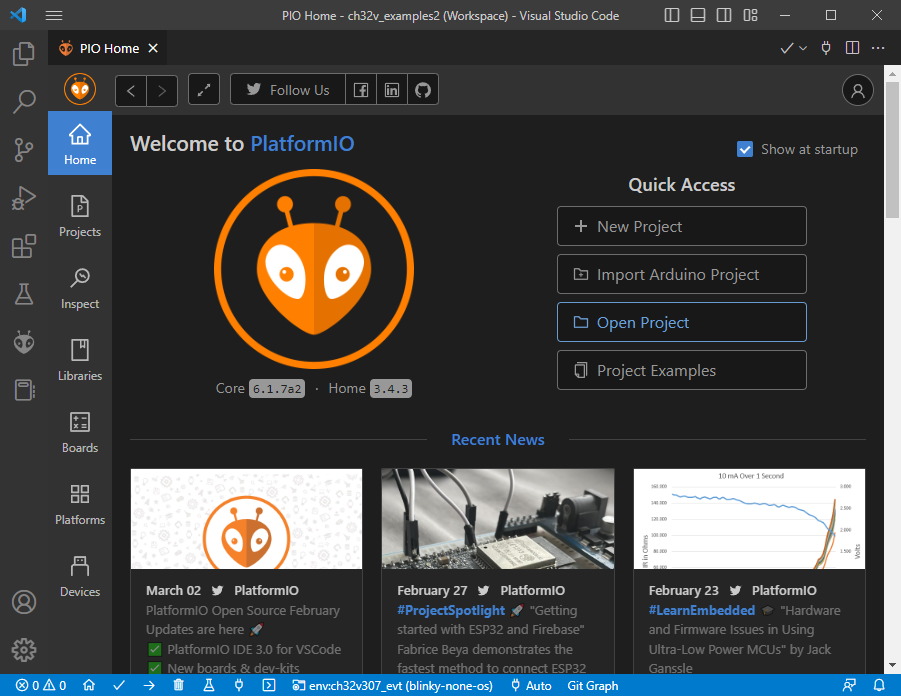

# CH32 PlatformIO Projects


[](https://GitHub.com/Community-PIO-CH32V/ch32-pio-projects/pulls/) [](https://GitHub.com/Community-PIO-CH32V/ch32-pio-projects)

## Description

This repository contains a collection of example projects to be used with the newly developed [CH32V PlatformIO integration](https://github.com/Community-PIO-CH32V/platform-ch32v). 

The examples range from using the [NoneOS SDK](https://github.com/Community-PIO-CH32V/framework-wch-noneos-sdk) over to [FreeRTOS](https://github.com/Community-PIO-CH32V/framework-wch-freertos) and [TencentOS] projects and more.

## General Usage Notes

As these are PlatformIO projects, the PlatformIO documentation at https://docs.platformio.org/ always applies. Especially useful are the [Getting started with VSCode + PlatformIO](https://docs.platformio.org/en/latest/integration/ide/vscode.html#installation), [CLI reference](https://docs.platformio.org/en/latest/core/index.html) and [platformio.ini options](https://docs.platformio.org/en/latest/projectconf/index.html) pages. 

## Installing the CH32V Platform

It is assumed that you have either installed VSCode + PlatformIO or PlatformIO on the CLI following the documentation above.

Open VSCode, expand the PlatformIO sidebar (ant icon) and click "PIO Home".


In the resulting PIO Home window, click on the "Platforms" sidebar and chose "Advanced Installation"


You will be asked for a repistory. Enter the URL and press "Install".
```
https://github.com/Community-PIO-CH32V/platform-ch32v.git
```



The platform should now be successfully installed.

Experienced [PlatformIO CLI](https://docs.platformio.org/en/latest/integration/ide/vscode.html#platformio-core-cli) users can also use the short-hand command
```
pio pkg install -g -p https://github.com/Community-PIO-CH32V/platform-ch32v.git
```

## Updating the CH32V Platform

Inevitibly, the platform version you installed at one point will become outdated.

There are two ways to update:

### Update via PlatformIO Home GUI

The PIO Home -> Platforms screen lists all installed platforms. This can be filtered by CH32. If a (git) update is available, there will be an "Update" button available.


### Update via PlatformIO Core CLI

In [the PlatformIO CLI](https://docs.platformio.org/en/latest/integration/ide/vscode.html#platformio-core-cli), execute
```
pio pkg update -g -p https://github.com/Community-PIO-CH32V/platform-ch32v.git
```

## Importing Examples

Clone this repository in an arbitrary folder.

```sh
git clone https://github.com/Community-PIO-CH32V/ch32-pio-projects
```

When using VSCode, open the PIO Home screen, e.g. via [the toolbar](https://docs.platformio.org/en/latest/integration/ide/vscode.html#platformio-toolbar). Use the "Open Project" open to navigate to one of the projects in the repository that you just cloned, e.g., `blinky-none-os`.




After opening the project, trust the VSCode workspace in the popup dialog. Your workspace should now contain the new project.


## Board selection

The available boards for an example are listed in the `platformio.ini` file of the project. For each board, there is an `[env:board]` section describing the build parameters. Refer to the documentation linked above for detailed information. 

For example, the `blinky-none-os` project contains 

```ini
[env]
platform = ch32v
framework = noneos-sdk
monitor_speed = 115200

[env:ch32v003f4p6_evt_r0]
board = ch32v003f4p6_evt_r0

[env:genericCH32V003A4M6]
board = genericCH32V003A4M6

[env:genericCH32V103C6T6]
board = genericCH32V103C6T6

[env:genericCH32V203F6T6]
board = genericCH32V203F6T6

[env:genericCH32V208CBU6]
board= genericCH32V208CBU6

[env:ch32v307_evt]
board = ch32v307_evt
framework = arduino
#....
```

Thus all these chips / development boards are available.

The available `board` values are the boards available in [the platform](https://github.com/Community-PIO-CH32V/platform-ch32v/tree/develop/boards). Note that not every board supports every framework. The CH32V003 series does not support frameworks other than `noneos-sdk` due its small RAM and Flash sizes.

In VSCode, to select a certain board environment (and project), you **must** use the [project environment switcher](https://docs.platformio.org/en/latest/integration/ide/vscode.html#project-tasks) in the bottom blue taskbar. Make sure your wanted board and project are selected before continuing. After selecting a new environment, the IntelliSense will be reloaded, which might take a bit.

For CLI users, the target environment is given as the `-e` switch in the `pio run` command, see [documentation](https://docs.platformio.org/en/latest/core/userguide/cmd_run.html).

## Compiling

In VSCode, use the [project tasks](https://docs.platformio.org/en/latest/integration/ide/vscode.html#project-tasks) list in the left PIO sidebar as normal to trigger the "Build" action, or a different action, for a certain environment. The environment you have previously selected as your default will be the expanded one.


For CLI users, executue the `pio run -e <environment>` command, as documentend above.

Compilation should result in a success, e.g.: 

```text
> pio run -e ch32v307_evt
Processing ch32v307_evt (board: ch32v307_evt; platform: ch32v; framework: noneos-sdk)
-----------------Verbose mode can be enabled via `-v, --verbose` option
CONFIGURATION: https://docs.platformio.org/page/boards/ch32v/ch32v307_evt.html
PLATFORM: WCH CH32V (1.0.0) > CH32V307 EVT
HARDWARE: CH32V307VCT6 144MHz, 32KB RAM, 288KB Flash
DEBUG: Current (wch-link) On-board (wch-link)       
PACKAGES:
 - framework-wch-noneos-sdk @ 2.10000.0+sha.afaf2a4 
 - tool-openocd-riscv-wch @ 2.1100.230103 (11.0)    
 - toolchain-riscv @ 1.80300.190927+sha.cb60df7
LDF: Library Dependency Finder -> https://bit.ly/configure-pio-ldf
LDF Modes: Finder ~ chain, Compatibility ~ soft
Found 0 compatible libraries
Scanning dependencies...
No dependencies
Building in release mode
Compiling .pio\build\ch32v307_evt\FrameworkNoneOSCore\core_riscv.o
[..]
Indexing .pio\build\ch32v307_evt\libFrameworkNoneOSVariant.a
Linking .pio\build\ch32v307_evt\firmware.elf
Checking size .pio\build\ch32v307_evt\firmware.elf
Advanced Memory Usage is available via "PlatformIO Home > Project Inspect"
RAM:   [=         ]   6.3% (used 2080 bytes from 32768 bytes)
Flash: [          ]   0.6% (used 1812 bytes from 294912 bytes)
Building .pio\build\ch32v307_evt\firmware.bin
================ [SUCCESS] Took 2.97 seconds ================
```

## Uploading

Note that the default upload method and available upload method is listed in the board manifest, e.g. for the [GD32F303CC board](https://github.com/CommunityGD32Cores/platform-gd32/blob/bbcdaa192cde7609d3da77e389eacd4f3d6c335e/boards/genericGD32F303CC.json#L43-L51), `stlink` is the default, attempting to upload via a ST-Link probe connected to the chip via SWD, using OpenOCD as tool. JLink, CMSIS-DAP, BMP, serial and USB-DFU (experimental) upload methods are available as well. To change the upload method, change [`upload_protocol`](https://docs.platformio.org/en/latest/projectconf/section_env_upload.html#upload-protocol) accordingly. SWD based upload methods can also be used as [`debug_tool`](https://docs.platformio.org/en/latest/projectconf/section_env_debug.html#debug-tool) for live-debugging. 

For VSCode users, use the project task "Upload".

For CLI users, use `pio run -t upload -e <environment>` as documented above.

Example of upload:

```
Configuring upload protocol...
AVAILABLE: wch-link
CURRENT: upload_protocol = wch-link
Uploading .pio\build\ch32v003f4p6_evt_r0\firmware.elf
Open On-Chip Debugger 0.11.0+dev-02415-gfad123a16-dirty (2023-01-03-10:00)
Licensed under GNU GPL v2
For bug reports, read
        http://openocd.org/doc/doxygen/bugs.html
debug_level: 1

Warn : Transport "sdi" was already selected
Ready for Remote Connections
[wch_riscv.cpu.0] Target successfully examined.
** Programming Started **
** Programming Finished **
** Verify Started **
** Verified OK **
** Resetting Target **
shutdown command invoked
================= [SUCCESS] Took 2.37 seconds =================
```

## Serial Monitor

For examples using serial output, you need to connect your WCH-Link(E)'s UART signals, or a USB-UART converter, to the target's UART pins to be able to observe it. For all chip series, when the `debug.h` code is used, this is by default UART1 on TX = PD5, RX = PD6. Note that the UART adapter and the target board should also share a common GND connection.

To access the serial montior in VSCode, execute the "Monitor" project task, as shown above.

To access it from the CLI, execute [`pio device monitor`](https://docs.platformio.org/en/latest/core/userguide/device/cmd_monitor.html).

The monitor is aborted by pressing the standard Ctrl+C combination.

Settings like the baud rate or adapter to use (if not auto-detected) are to be found in the [monitor section](https://docs.platformio.org/en/latest/projectconf/section_env_monitor.html) of the `platformio.ini`.

Example:

```
>  Executing task in folder uart-printf-none-os: C:\Users\Max\AppData\Roaming\Python\Python311\Scripts\platformio.exe run --target upload --target monitor --environment ch32v003f4p6_evt_r0 

--- Terminal on COM4 | 115200 8-N-1
--- Available filters and text transformations: colorize, debug, default, direct, hexlify, log2file, nocontrol, printable, send_on_enter, time
--- More details at https://bit.ly/pio-monitor-filters
--- Quit: Ctrl+C | Menu: Ctrl+T | Help: Ctrl+T followed by Ctrl+H
SystemClk: 48000000
DeviceID: 00000500
This is printf example
Program over, press reset button
```

## Debugging

If a SWD capable debug probe is connected to the target, and configured via [`debug_tool`](https://docs.platformio.org/en/latest/projectconf/section_env_debug.html#debug-tool), you can open the "Debug" sidebar in VSCode. In the upper left, the configuration "PIO Debug (your-project-name)" should be selected. By pressing the the "Play" button then, PlatformIO will start compiling the project in debug mode, start the debug server (e.g., OpenOCD) and connect to it with the appropriate GDB client. 

**Note:** Currently, only the WCH-Link(E) is supported as debugging adapter.

It should hit a breakpoint in the `main()` function of the project (which can e.g. be in the Arduino core). From there, use the regular Step Over, Step Into, Step Out of, etc. buttons for debug control.

VSCode also shows the state of all peripheral registers (such as `USART1`, `ADC0`, etc.) and decodes them. The RISC-V core's internal registers are shown in the expandable "Registers" panel.

Note all the other possible [debug configuration options](https://docs.platformio.org/en/latest/projectconf/section_env_debug.html).


The same can be achieved from the CLI, [as documented](https://docs.platformio.org/en/latest/core/userguide/cmd_debug.html#examples). This launches the user into a GDB session.

```
> pio debug -e ch32v003f4p6_evt_r0 --interface=gdb -- -x .pioinit
C:\Users\Max\.platformio\packages\toolchain-riscv\bin\riscv-none-embed-gdb.exe: warning: Couldn't determine a path for the index cache directory.
Reading symbols from C:\Users\Max\Desktop\ch32_dev\platform-ch32v\examples\blinky-none-os\.pio\build\ch32v003f4p6_evt_r0\firmware.elf...
PlatformIO Unified Debugger -> https://bit.ly/pio-debug
PlatformIO: debug_tool = wch-link
PlatformIO: Initializing remote target...
The target architecture is assumed to be riscv:rv32
Open On-Chip Debugger 0.11.0+dev-02415-gfad123a16-dirty (2023-01-03-10:00)
Licensed under GNU GPL v2
For bug reports, read
        http://openocd.org/doc/doxygen/bugs.html
Info : only one transport option; autoselect 'sdi'
Warn : Transport "sdi" was already selected
Ready for Remote Connections
Info : tcl server disabled
Info : telnet server disabled
Info : WCH-LinkE  mode:RV version 2.8
Info : wlink_init ok
Info : clock speed 6000 kHz
Info : [wch_riscv.cpu.0] datacount=2 progbufsize=8
Info : [wch_riscv.cpu.0] Examined RISC-V core; found 1 harts
Info : [wch_riscv.cpu.0]  XLEN=32, misa=0x40800014
[wch_riscv.cpu.0] Target successfully examined.
Info : starting gdb server for wch_riscv.cpu.0 on pipe
Info : accepting 'gdb' connection from pipe
Info : device id = 0xabc8abcd
Info : flash size = 16kbytes
main () at src\main.c:23
23              NVIC_PriorityGroupConfig(NVIC_PriorityGroup_2);
Temporary breakpoint 1 at 0x47c: file src\main.c, line 22.
Info : [wch_riscv.cpu.0] Hart unexpectedly reset!
Loading section .init, size 0xa0 lma 0x0
Loading section .text, size 0x514 lma 0xc0
Loading section .data, size 0x18 lma 0x5d4
Info : Padding image section 0 at 0x000000a0 with 32 bytes
Info : [wch_riscv.cpu.0] Hart unexpectedly reset!
Start address 0x0, load size 1484
Transfer rate: 3 KB/sec, 494 bytes/write.
PlatformIO: Initialization completed
(gdb) PlatformIO: Resume the execution to `debug_init_break = tbreak main`
PlatformIO: More configuration options -> https://bit.ly/pio-debug
Continuing.
Note: automatically using hardware breakpoints for read-only addresses.

Temporary breakpoint 1, main () at src\main.c:22
22      {
(gdb) backtrace
#0  main () at src\main.c:22
(gdb)
```
